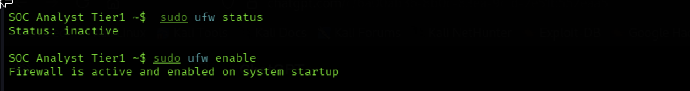
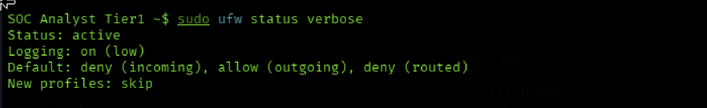
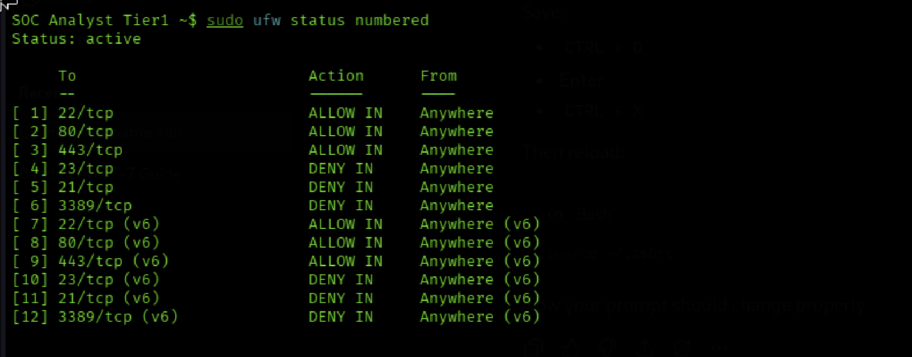
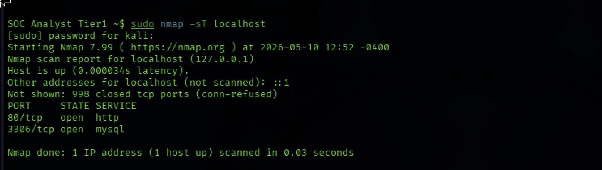
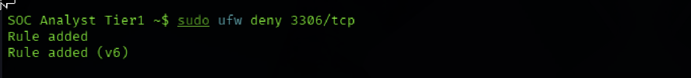
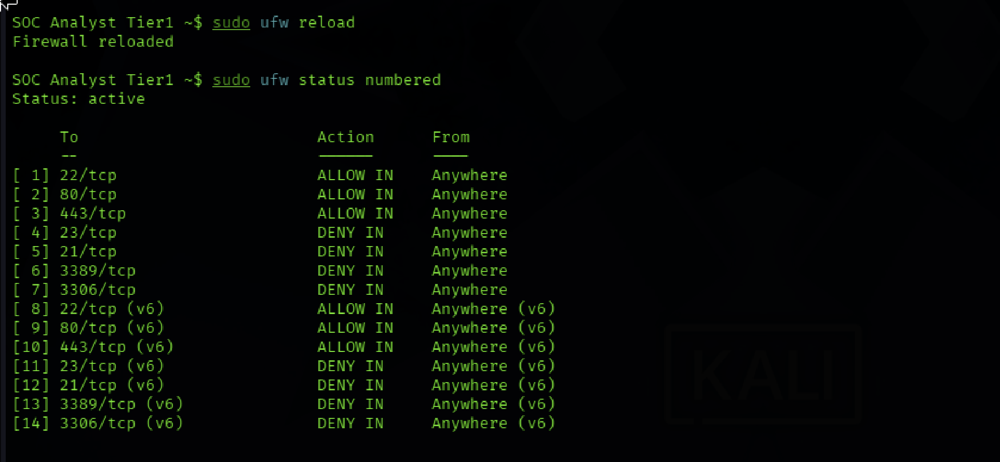
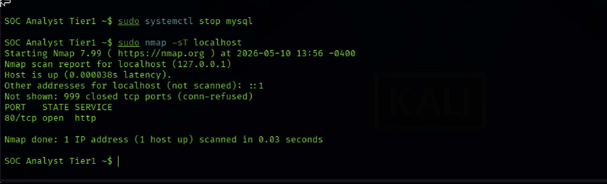

# SOC Tier 1 Incident Report: Firewall Rules & Network Segmentation

---

## Incident Summary

- **Incident Type:** Network Perimeter Hardening & Layered Service Remediation
- **Severity:** Medium (Exposed MySQL Service Discovered & Remediated)
- **Detection Method:** Default-Deny Firewall Implementation + Nmap Validation + Service-Level Audit
- **Tools Used:** UFW (Uncomplicated Firewall), Nmap 7.99, systemctl
- **Status:** Complete 7 Rules Active, MySQL Closed via Layered Defense

---

## Executive Summary

A firewall policy was designed and implemented on a Kali Linux VM using UFW. A default deny posture was applied to all incoming traffic, with explicit allow rules for essential services (SSH, HTTP, HTTPS) and explicit deny rules for high risk legacy or remote access ports (Telnet, FTP, RDP, MySQL).

During Nmap validation, an exposed MySQL service on port `3306/tcp` was discovered. A UFW deny rule was applied immediately, but re-validation revealed the service remained reachable on the loopback interface a known limitation where UFW does not filter traffic on `lo` by default. Remediation required a layered approach: UFW deny rule plus service shutdown via `systemctl`. Final re-validation confirmed full closure.

---

## Affected System

- **Target Host:** Kali Linux VM (localhost)
- **Firewall:** UFW (Uncomplicated Firewall)
- **Validation Tools:** Nmap 7.99, systemctl
- **Default Inbound Policy:** Deny
- **Allowed Services:** SSH (22/tcp), HTTP (80/tcp), HTTPS (443/tcp)
- **Denied Services:** Telnet (23/tcp), FTP (21/tcp), RDP (3389/tcp), MySQL (3306/tcp)

---

## Investigation Methodology

---

### 1. UFW Enablement



- Verified UFW initial state as inactive
- Activated UFW with `sudo ufw enable`
- Confirmed firewall is active and enabled on system startup

### SOC Observations:

- Firewall activation is the foundational step in host-based defense
- Verifying active state prevents a false sense of security from inactive rules
- UFW provides a clean abstraction over iptables for policy management

---

### 2. Default-Deny Policy Configuration



- Verified default policy via `sudo ufw status verbose`
- Confirmed `deny (incoming)`, `allow (outgoing)`, `deny (routed)`
- Logging confirmed active at low level

### SOC Observations:

- Default-deny ingress is the gold standard for firewall posture
- Allow rules are only meaningful when applied over a deny baseline
- Logging must be enabled for downstream SIEM correlation

---

### 3. Initial Rule Implementation



- Created allow rules for SSH (`22/tcp`), HTTP (`80/tcp`), HTTPS (`443/tcp`)
- Created explicit deny rules for Telnet (`23/tcp`), FTP (`21/tcp`), RDP (`3389/tcp`)
- Verified rule numbering with `sudo ufw status numbered`

### SOC Observations:

- Numbered rule lists support audit and selective rule modification
- Explicit deny rules make policy intent visible during audits
- Cleartext protocols (Telnet, FTP) must be denied even in lab environments
- IPv6 rules auto-generated alongside IPv4 both must be reviewed

---

### 4. Nmap Validation Scan & Vulnerability Discovery



- Executed `sudo nmap -sT localhost` to validate firewall posture
- Confirmed allowed services responded as expected
- **Discovered exposed MySQL service on port `3306/tcp`** not previously denied

### SOC Observations:

- External validation is non-negotiable rule lists and reality must agree
- Database services must never be reachable from untrusted networks
- MySQL on `3306/tcp` is a recurring exposure finding in production audits

---

### 5. Firewall-Level Remediation



- Applied immediate firewall remediation: `sudo ufw deny 3306/tcp`
- Captured rule addition confirmation for both IPv4 and IPv6
- Reduced exposure at the firewall layer

### SOC Observations:

- First line remediation should always be the firewall layer
- Rule addition provides immediate audit trail evidence
- Single control remediation is rarely complete validation must follow

---

### 6. Updated Rule Validation



- Re-ran `sudo ufw status numbered` to confirm rule integration
- Verified 7 unique rules now in policy (14 total with IPv6 duplicates)
- Confirmed `3306/tcp DENY IN` appended to the ruleset

### SOC Observations:

- Rule addition does not equal effective remediation re-validation is required
- Final policy must be exported for version control and audit retention
- Updated rule lists should be diffed against prior state for change management

---

### 7. Service Shutdown & Final Re-Validation



- Re-validation Nmap scan revealed `3306/tcp` was **still reachable** despite UFW deny rule
- Identified root cause: UFW does not filter loopback (`lo`) traffic by default
- Applied second layer remediation: `sudo systemctl stop mysql`
- Final Nmap scan confirmed `3306/tcp` no longer responding only `80/tcp open http` remained

### SOC Observations:

- Single-layer remediation can fail when services bind to interfaces the firewall does not filter
- Loopback exposure is a frequently missed audit finding in production environments
- Defense-in-depth (firewall + service hardening) is the correct remediation pattern
- Re-validation after every remediation step is the only way to confirm closure

---

## Firewall Rules Policy

| Port      | Service | Action     | Reason                                |
|-----------|---------|------------|---------------------------------------|
| 22/tcp    | SSH     | ✅ ALLOW   | Secure remote administration          |
| 80/tcp    | HTTP    | ✅ ALLOW   | Web server traffic                    |
| 443/tcp   | HTTPS   | ✅ ALLOW   | Encrypted web traffic                 |
| 23/tcp    | Telnet  | ❌ DENY    | Cleartext credentials — attack vector |
| 21/tcp    | FTP     | ❌ DENY    | Cleartext credentials — attack vector |
| 3389/tcp  | RDP     | ❌ DENY    | Ransomware ingress — blocked          |
| 3306/tcp  | MySQL   | ❌ DENY    | Database exposed — remediated         |

---

## Vulnerability Discovered During Testing

| Finding                | Detail                                                            |
|------------------------|-------------------------------------------------------------------|
| **Port**               | `3306/tcp`                                                        |
| **Service**            | MySQL Database                                                    |
| **Risk**               | Database directly accessible data exfiltration risk             |
| **Discovery Method**   | Nmap validation scan against localhost                            |
| **First-Layer Action** | UFW deny rule applied                                             |
| **Validation Result**  | Service still reachable UFW does not filter loopback by default |
| **Second-Layer Action**| Service shutdown via `systemctl stop mysql`                       |
| **Re-Validation**      | Confirmed via post remediation Nmap scan                          |
| **Status**             | Remediated ✅ (Layered Defense Applied)                           |

---

## Indicators of Compromise / Exposure (IOCs)

| Type                | Indicator                                                | Source           |
|---------------------|----------------------------------------------------------|------------------|
| Exposed Service     | MySQL on `3306/tcp`                                      | Nmap Scan        |
| Cleartext Protocol  | Telnet (`23/tcp`) — denied                               | Policy Audit     |
| Cleartext Protocol  | FTP (`21/tcp`) — denied                                  | Policy Audit     |
| Remote Access Risk  | RDP (`3389/tcp`) - denied                                | Policy Audit     |
| Allowed Surface     | SSH (`22/tcp`), HTTP (`80/tcp`), HTTPS (`443/tcp`)       | Policy Definition|
| Loopback Bypass     | UFW does not filter `lo` interface by default            | Validation Test  |

---

## MITRE ATT&CK Mapping

| Behavior                              | Technique ID | Description                                                |
|---------------------------------------|--------------|------------------------------------------------------------|
| Network Service Discovery             | T1046        | Nmap simulates adversary port enumeration                  |
| External Remote Services              | T1133        | Allowed services hardened via firewall                     |
| Remote Services: SSH                  | T1021.004    | SSH allowed but restricted to authorized ingress           |
| Remote Services: RDP                  | T1021.001    | RDP denied to prevent ransomware ingress                   |
| Exploit Public-Facing Application     | T1190        | Reduced attack surface mitigates this technique            |
| Valid Accounts                        | T1078        | Cleartext-credential protocols (FTP, Telnet) denied        |
| Impair Defenses: Disable/Modify Tools | T1562.004    | UFW protects against unauthorized firewall modification    |

---

## SOC Analyst Findings

- Default-deny ingress policy successfully implemented on the host
- Three essential services (SSH, HTTP, HTTPS) are explicitly allowed
- Four high-risk services (Telnet, FTP, RDP, MySQL) are explicitly denied
- MySQL service was found exposed during Nmap validation
- UFW deny rule alone failed to close the exposure due to loopback interface behaviour
- Layered remediation (UFW + service shutdown) successfully closed the gap
- Final firewall policy contains 7 unique rules, all active and validated
- Post-remediation Nmap scan confirmed full closure

---

## SOC Analyst Response

- Maintain default-deny ingress posture as the baseline standard
- Validate firewall rules with external scans after every policy change
- Treat all database services (MySQL, PostgreSQL, MSSQL, Redis) as deny-by-default
- Apply layered remediation when services bind to interfaces the firewall does not filter
- Audit listening services regularly with `ss -tulpn` and `netstat`
- Stop or rebind services that do not require network exposure
- Forward UFW logs to a SIEM (Splunk) for ingress denial alerting
- Schedule recurring Nmap audits to detect configuration drift

---

## Analyst Insight

Firewall hardening is one of the highest leverage controls available to a SOC, but a single control is rarely sufficient. The MySQL exposure caught during validation appeared resolved at the firewall layer yet remained reachable via the loopback interface, which UFW does not filter by default. This is a real-world defense-in-depth lesson: rule lists alone do not guarantee closure, and validation must extend beyond policy review to include service level audit. The strongest SOC analysts assume their first-line remediation is incomplete until external validation proves otherwise.

---

## Learning Outcome

This investigation demonstrates the ability to:

- Configure UFW with a default deny ingress posture
- Author and number firewall rules for SOC audit and handoff
- Validate firewall policy with Nmap port scanning
- Detect exposed services and apply immediate remediation
- Recognize firewall limitations on loopback interfaces
- Apply layered remediation (firewall + service hardening) under defense-in-depth principles
- Audit listening services with `systemctl` and Nmap re-validation
- Map firewall controls to MITRE ATT&CK adversary techniques
- Document the discovery → remediation → re-validation cycle in full

---

## Repository Structure

```
firewall-rules-network-segmentation-lab/
├── README.md
└── screenshots/
    ├── 01_ufw_enabled.png
    ├── 02_ufw_default_policy.png
    ├── 03_ufw_rules_numbered.png
    ├── 04_nmap_scan_results.png
    ├── 05_ufw_deny_mysql.png
    ├── 06_ufw_final_rules.png
    └── 07_nmap_post_remediation.png
```

---

## Conclusion

This lab demonstrates a real world firewall configuration and network segmentation workflow. Using UFW, a strict default deny ingress policy was implemented with only essential services allowed. Nmap validation revealed an exposed MySQL service that required layered remediation: UFW deny rule plus service shutdown. Final re-validation confirmed full closure. The output mirrors the exact process a SOC or network security engineer follows when hardening a Linux host policy authoring, validation, discovery, layered remediation, and re-validation in a closed loop.
